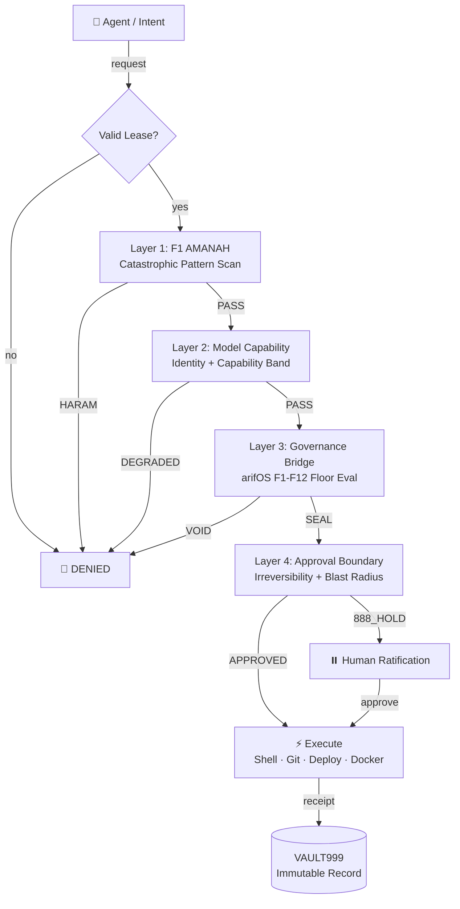

<!-- SOT-MANIFEST
federation_release: v2026.07.23
last_verified: 2026-07-23T22:00Z
live_commit: 3a50f44
qqq_version: v1.1.1 (10/10 tests passing, verdict round-trip closed)
seal_chain: append-only (chattr +a) + Merkle anchor every 100 receipts
sense_port: 7071 (healthy)
mcp_port: 7072 (healthy)
authority_ceiling: 777_FORGE (execution only — never adjudicate)
owner_summary: GREEN
truth_rule: MCP tools/list on :7072 beats any static count in prose
-->

# A-FORGE — Governed Execution Shell

[](https://github.com/ariffazil/A-FORGE/actions/workflows/agentic-ci.yml)
[](https://github.com/ariffazil/A-FORGE/actions/workflows/a-forge-boundary-guard.yml)
[](https://github.com/ariffazil/A-FORGE/actions/workflows/governance-gate.yml)
[](https://mcp.arif-fazil.com/mcp)
[](LICENSE)

> **A-FORGE is the hands. arifOS is the brain. The hands execute. The brain judges. The hands never adjudicate.**
>
> **DITEMPA BUKAN DIBERI — Execution is forged, not given.**

---

## TL;DR — Three Audiences

**For human operators (Arif):** A-FORGE is the execution engine. It builds, deploys, runs code, and manages Docker — but only after arifOS judges and you (F13) approve. [Jump to §10](#10-for-human-operators)

**For AI agents:** Register your forge instrument, get a lease, execute through governed gates. Never self-authorize. Never adjudicate. [Jump to §11](#11-for-ai-agents)

**For institutions:** A-FORGE is the constitutional execution substrate — 52 MCP tools, 4-layer forge gate, full audit trail on every mutation. [Jump to §12](#12-for-institutions)

---

## 1. Federation Position

```
                         ┌─────────────────────────┐
                         │      F13 SOVEREIGN       │
                         │     Arif bin Fazil       │
                         └────────────┬────────────┘
                                      │ approves
                                      ▼
┌─────────────────────────────────────────────────────────────────────┐
│                          AAA COCKPIT (:3001)                         │
│                    Routes, displays, never judges                    │
└────────────────────────────────┬────────────────────────────────────┘
                                 │ routes to
              ┌──────────────────┼──────────────────┐
              ▼                  ▼                  ▼
      ┌──────────┐       ┌──────────┐       ┌──────────┐
      │  arifOS   │       │ A-FORGE  │       │  DOMAIN   │
      │  JUDGES   │       │ EXECUTES │       │  ORGANS   │
      │  :8088    │       │  :7071   │       │ GEOX :8081│
      │ F1-F13   │       │  :7072   │       │WEALTH:18082│
      │ VAULT999 │       │ ← HERE   │       │ WELL :18083│
      └──────────┘       └──────────┘       └──────────┘
```

**Trinity roles:**
- **arifOS** = LAW/JUDGMENT ("May this happen?")
- **AAA** = STATE/ROUTING ("Where does it go?")
- **A-FORGE** = EXECUTION/MUTATION ("How do we safely do it?")

**Canonical flow:** Arif (F13) → AAA (IDENTITY) → arifOS (JUDGE) → A-FORGE (EXECUTE) → VAULT999 (SEAL)

---

## 2. What A-FORGE Is (and Is Not)

| ✅ EXECUTES | ❌ NEVER |
|-------------|---------|
| Builds, deploys, runs code | Geoscience — Vsh, PHIE, Sw, porosity (→ GEOX) |
| Shell, git, Docker, browser ops | Economics — NPV, IRR, capital allocation (→ WEALTH) |
| 52 MCP tools under constitutional gates | Constitutional verdicts — SEAL/HOLD/VOID (→ arifOS) |
| Routes intent to domain organs via A2A | Self-authorization — no execution without lease |
| Full audit trail on every mutation | NumPy, Pandas, SciPy in execution path |

---

## 3. Architecture — Hexagonal Layers

```
src/
├── domain/          # Pure business logic — no I/O
│   ├── engine/      # AgentEngine.ts — core agent loop
│   ├── governance/  # 4-layer forge gate
│   ├── planner/     # PlanValidator — verifyGovernanceCard + reversibility
│   └── agents/      # Agent profiles, capability definitions
├── application/     # Use cases — services, approval, memory, A2A
├── infrastructure/  # Adapters — LLM, tools, vault, bridges, CLI
└── interfaces/      # Delivery — server.ts (Express :7071), MCP :7072, config
```

---

## 4. The 4-Layer Forge Gate

Every execution passes ALL four layers. No skipping, no silence.

| Layer | Component | Rule |
|-------|-----------|------|
| **1: F1 AMANAH** | Catastrophic pattern scan | HARAM/BLOCK → HALT |
| **2: Model Capability** | Identity + capability band check | DEGRADED/MISSING → HALT |
| **3: Governance Bridge** | F1–F12 floor eval via arifOS | VOID → HALT |
| **4: Approval Boundary** | Irreversibility + blast radius | APPROVED → PROCEED |

**Gödel Lock:** A-FORGE cannot seal its own `forge_execute` outcomes without external witness (arifOS kernel or Arif F13). The executor cannot certify itself.



### What Is a Lease?

A **lease** is a bounded permission grant — the execution safety object of A-FORGE:

- **Who may act** — the agent or instrument
- **What may be changed** — scope of mutation
- **Where action may occur** — filesystem, network, shell boundaries
- **How long permission lasts** — time-bound, auto-expiring
- **What witness is required** — rollback plan, audit trace

> Without a valid lease, no mutation. The hands never self-authorize.

### Federation Separation of Powers

| Layer | Role | Can | Cannot |
|-------|------|-----|--------|
| **ARIF** | Sovereign | Veto, approve, decide | Be overridden |
| **AAA** | State / Cockpit | Display, route, queue, register | Judge, execute, seal |
| **arifOS** | Judge | Issue SEAL/HOLD/VOID/SABAR | Execute mutations |
| **Domain Organs** | Witnesses | Compute and reflect evidence | Decide alone |
| **A-FORGE** | Executor | Build, deploy, mutate | Self-authorize |
| **VAULT999** | Ledger | Record immutable seals | Edit or delete history |

> AAA routes and displays. arifOS judges. Domain organs witness. A-FORGE executes. VAULT999 records. ARIF decides.

---

## 5. Quick Start

```bash
cd /root/A-FORGE

npm install && npm run build           # Build TypeScript

npm test                                # AgentEngine suite
make test                               # Full battery (security + build + all suites)

# MCP gateway (stdio — local agent ingress)
npm run mcp:stdio

# Health checks
curl -s http://localhost:7071/health | python3 -m json.tool   # Sense API
curl -s http://localhost:7072/health | python3 -m json.tool   # MCP gateway

# Deploy
systemctl restart a-forge              # Express :7071
systemctl restart a-forge-mcp          # MCP :7072
```

---

## 6. The Execution Chain

```
INTENT → PLAN → arif_judge (SEAL) → forge_execute (4-gate) → VAULT999 (SEAL)
```

1. **Intent** declared by human or agent
2. **Plan** validated by PlanValidator (reversibility, governance card)
3. **Judge** arifOS issues SEAL/HOLD/VOID
4. **Execute** A-FORGE runs through 4-layer forge gate
5. **Seal** VAULT999 records immutable receipt

---

## 7. Deployment Surfaces

| Surface | Port | Transport | Access |
|---------|------|-----------|--------|
| **Sense API** | 7071 | Express HTTP | Internal VPS |
| **MCP Gateway** | 7072 | Streamable HTTP + stdio | Local + federation organs |
| **Public MCP** | — | `https://mcp.arif-fazil.com/mcp` | Proxied through arifOS kernel |
| **A2A** | — | Via AAA cockpit | Agent-to-agent mesh |

---

## 8. Service Architecture

```bash
# Systemd services
a-forge.service                    # Express API on :7071
a-forge-mcp.service                # MCP gateway on :7072

# Key paths
/root/A-FORGE/                     # Source + build
/opt/a-forge/app/                  # Deployed runtime (rsync)
/root/A-FORGE/identity.toml        # Canonical service identity
/root/A-FORGE/.well-known/         # Agent cards + discovery
```

---

## 9. Federation Cross-Reference

| Organ | Role | Port | Repo |
|-------|------|------|------|
| arifOS | Constitutional kernel | 8088 | [ariffazil/arifos](https://github.com/ariffazil/arifos) |
| AAA | State + cockpit | 3001 | [ariffazil/AAA](https://github.com/ariffazil/AAA) |
| GEOX | Earth intelligence | 8081 | [ariffazil/geox](https://github.com/ariffazil/geox) |
| WEALTH | Capital intelligence | 18082 | [ariffazil/wealth](https://github.com/ariffazil/wealth) |
| WELL | Vitality guard | 18083 | [ariffazil/well](https://github.com/ariffazil/well) |
| **A-FORGE** | Execution shell | 7071/7072 | ← you are here |

---

## 10. For Human Operators (Arif)

**What you see:** A-FORGE executes. It builds, deploys, runs code, manages the VPS — after you or arifOS says it's safe.

**What you do:** Review HOLDs, approve irreversible actions (F13), observe execution receipts.

**Key endpoints:**
- Health: `curl localhost:7071/health`
- MCP tools: `curl localhost:7072/health`
- Public door: `https://mcp.arif-fazil.com/mcp`

**Your absolute veto:** No agent can self-authorize. No execution without a lease. Your F13 word is final.

---

## 11. For AI Agents (Forge Instruments)

**You are a forge instrument.** Your job is execution under governance.

**Rules:**
1. Get a lease before executing → `forge_lease_request`
2. Every execution goes through the 4-layer forge gate — no skipping
3. `forge_execute` for MUTATE-class ops requires prior `arif_judge` SEAL
4. Never self-authorize — the forge has no authority to adjudicate
5. All claims carry epistemic labels: OBS, DER, INT, SPEC
6. Boundary violations (geophysics, economics, verdicts) trigger 888_HOLD

**Agent card:** `public/a2a/agent-card.example.json`

---

## 12. For Institutions

A-FORGE provides governed, auditable execution:

| Property | How A-FORGE delivers it |
|----------|------------------------|
| **Separation of powers** | Executor ≠ Judge — A-FORGE never adjudicates |
| **Constitutional gates** | 4-layer forge gate on every mutation |
| **Full audit trail** | Every execution logged, hash-chained to VAULT999 |
| **Boundary enforcement** | Geophysics → GEOX, Economics → WEALTH, Verdicts → arifOS |
| **Lease-based authority** | No execution without explicit lease scope |
| **Gödel Lock** | External witness required for irreversible actions |

---

## 13. Build, Test, Deploy (CI)

```bash
# Standard CI
npm install && npm run build    # TypeScript compile
make test                       # Security audit + build + all test suites

# Single test
node dist/test/AgentEngine.test.js
node --test --test-name-pattern="multi-turn tool execution" dist/test/AgentEngine.test.js

# Deploy (T2 — announce 10s)
npm run build
systemctl restart a-forge && systemctl restart a-forge-mcp
curl -s http://localhost:7071/health | python3 -m json.tool
```

**CI Architecture:** Dual-lane → Standard CI + BIJAKSANA (ΔS, Φ, Ψ, Ω) → Agentic CI Report → Check Run → Federation cron → VAULT999 seal.

---

## 14. Constitutional Boundary

```
    ┌──────────────────────────────────────────┐
    │                                          │
    │   A-FORGE EXECUTES.                      │
    │   arifOS JUDGES.                         │
    │   AAA DISPLAYS.                          │
    │   The domain organs WITNESS.             │
    │   Arif HOLDS THE VETO.                   │
    │                                          │
    │   The hands never judge.                 │
    │   The forge never self-authorizes.       │
    │   The executor never seals its own work. │
    │                                          │
    │   Without lease → no action.             │
    │   Without SEAL → no mutation.            │
    │   Without witness → no seal.             │
    │                                          │
    │   DITEMPA BUKAN DIBERI                  │
    │   Execution is forged, not given.        │
    │   999 SEAL ALIVE.                        │
    │                                          │
    └──────────────────────────────────────────┘
```
