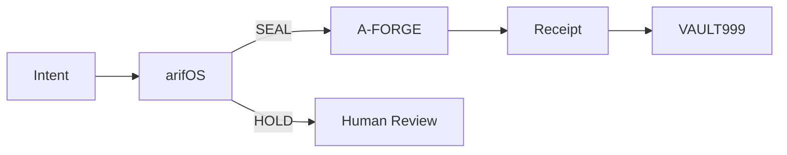

<!-- SOT-MANIFEST
federation_release: v2026.08.25
last_verified: 2026-08-25T04:30:00Z
live_commit: 47c679fa (chore(zen): remove README_SKELETON.md)
source_commit: 0fc9195 (aligned: source = built = deployed)
sense_port: 7071 (healthy)
forge_port: 7072 (healthy)
tools_live: 114 (live-witnessed 2026-08-25 via :7072/health — beats any static count in prose)
authority_ceiling: 777_FORGE (execution only — never adjudicate)
act_ingress: HMAC-SHA256 verified, FI alias map complete
owner_summary: GREEN (mcp_gateway_healthy, identity_present, deployment_drift: false)
truth_rule: MCP tools/list on :7072 beats any static count in prose
infra_organs: arifFlow:7073 METABOLISM, FED:7074 ADVISORY, FLAME:18901 ADVISORY, FRAME:frame-organ OBSERVE
readme_note: ZEN first-fold — full technical README preserved at docs/README-FULL.md
-->

# A-FORGE

## Execute only what has been authorized.

The governed execution shell of the arifOS Federation.

A-FORGE is the hands.
It executes.
It never judges.
It never self-authorizes.

**DITEMPA BUKAN DIBERI** — Forged, Not Given.

---

## Why A-FORGE exists

Three questions govern every action:

1. Who **performs** the action?
2. Who **approved** the action?
3. Who **witnessed** the action?

A-FORGE answers only the first.

Approval belongs to arifOS.
Authority belongs to the sovereign.
Receipts belong to VAULT999.

## What you get

```text
Input:
SEAL + lease + session

Output:
Execution + receipt
```

## What A-FORGE does NOT do

> **A-FORGE is not a judge.**
> **A-FORGE is not a policy engine.**
> **A-FORGE does not emit SEAL.**
> **A-FORGE does not emit HOLD.**
> **A-FORGE never certifies its own execution.**

## 30-second proof

```text
Request: "delete production database"
  Without SEAL        → HOLD

Request: "deploy approved release"
  With SEAL + lease   → Execute
                     → Receipt
                     → VAULT999
```

## Architecture in one sentence

**The executor never certifies its own work.**



## Federation card

ARIF = Sovereign · arifOS = Law · AAA = Institution · A-FORGE = Hands

**ARIF vetoes. arifOS judges. AAA routes. A-FORGE executes.**

Full technical README: [docs/README-FULL.md](./docs/README-FULL.md) ·
MCP door: [forge.arif-fazil.com/mcp](https://forge.arif-fazil.com/mcp)
