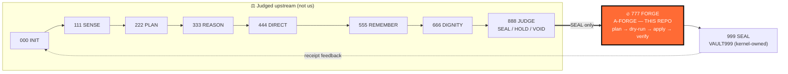
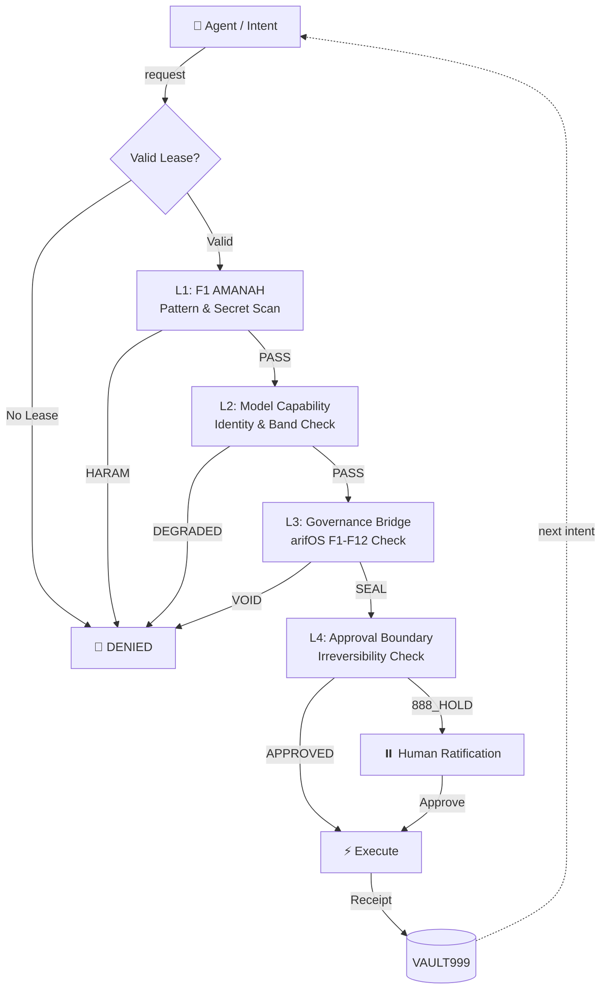
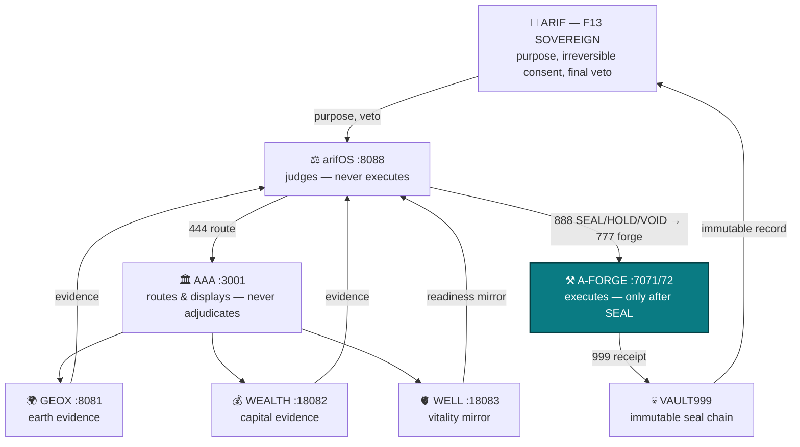
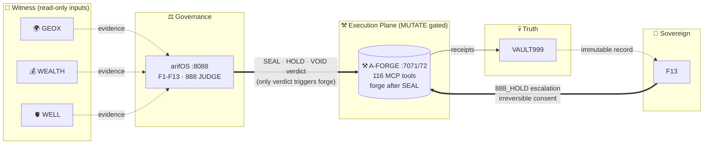

<!-- SOT-MANIFEST
federation_release: v2026.08.14
last_verified: 2026-08-14T20:50:00Z
live_commit: dbaa2bff (fix(act-ingress): map FI canonical short forms (qwen, kimi) in ACTOR_ALIAS_MAP)
live_port: 7072 (healthy — stateless MCP 2026-07-28, 116 tools live-witnessed via tools/list)
sense_port: 7071 (healthy)
tools_exposed_via_mcp: 116 (live-witnessed via MCP tools/list on :7072 — beats any prose count)
authority_ceiling: 777_FORGE (execution only — never adjudicate)
act_ingress: HMAC-SHA256 verified, FI alias map complete (qwen/kimi short forms 2026-08-14)
owner_summary: GREEN (mcp_gateway_healthy, act_bridge cross-organ bind PASS, deployment_drift: false)
truth_rule: MCP tools/list on :7072 beats any static count in prose
infra_organs: arifFlow:7073 METABOLISM, FED:7074 ADVISORY, FLAME:18901 ADVISORY, FRAME:frame-organ.service OBSERVE
-->

# ⚒️ A-FORGE — Governed Execution Shell

[](https://github.com/ariffazil/A-FORGE/actions)
[](https://github.com/ariffazil/A-FORGE/actions)
[](https://github.com/ariffazil/A-FORGE/actions)
[](https://forge.arif-fazil.com/mcp)
[](https://modelcontextprotocol.io)
[](#-the-4-layer-forge-gate--inner-loop)
[](#-where-a-forge-sits-in-the-federation)
[](https://arifos.arif-fazil.com)
[](./LICENSE)

> **A-FORGE is the hands. It executes. It never self-authorizes.**
> **DITEMPA BUKAN DIBERI — Execution is forged, not given.**

**A-FORGE** is the governed execution subprocessor of the arifOS Federation. Operating on ports **7071** (Sense API) and **7072** (FastMCP Gateway), it exposes **116 live-witnessed governed tools** for filesystem mutations, Git operations, Docker container fleets, CI/CD pipelines, and VPS infrastructure — all gated behind the arifOS constitutional kernel.

**For humans:** nothing in this shell mutates production without a kernel SEAL, a lease, and — for irreversible acts — your F13 consent.
**For agents:** bring a session ACT, request a scoped lease, classify your action, and expect the 4-layer gate to read your command before reality does.

---

## 🔢 The Canonical Ladder 000–999 — A-FORGE lives at 777

A-FORGE occupies exactly **one station** of the federation ladder. It can never climb to 888 (judge) or 999 (seal) — that separation is the Gödel Lock.



| Station | Who | A-FORGE's relationship |
|---|---|---|
| 000–666 | arifOS (cognition) | A-FORGE receives their output as **evidence**, never as commands |
| **777** | **A-FORGE (this repo)** | The ONLY mutation station. Lease + session + 4-layer gate |
| 888 | arifOS judge | A-FORGE **cannot** reach it. No self-adjudication |
| 999 | arifOS seal | A-FORGE writes receipts; only the kernel seals them to VAULT999 |

---

## 🔒 The 4-Layer Forge Gate — Inner Loop



### ASCII — the gate in one glance

```
 intent ─▶ [lease?] ─▶ [L1 AMANAH] ─▶ [L2 identity] ─▶ [L3 kernel F1-F12] ─▶ [L4 irreversible?] ─▶ ⚡ execute
   │           │             │              │                 │                    │
   ▼           ▼             ▼              ▼                 ▼                    ▼
 🤖 agent   🚫 DENIED     🚫 HARAM       🚫 DEGRADED      ⏸️ 888_HOLD           🧍 F13 consent
                                                                     │                   │
                                                                     ▼                   ▼
                                                              🔒 arifOS judge    receipt → 💀 VAULT999
```

### The Gödel Lock
A-FORGE **cannot seal its own execution outcomes**. Every `forge_execute` receipt must be cryptographically witnessed and sealed by the **arifOS Kernel** or ratified by **Arif (F13 Sovereign)**. The executor never certifies its own work.

---

## 🌐 Federation — Outer Loop

The 4-layer gate above is A-FORGE's inner loop. It only ever fires after the federation's
outer loop hands it a SEAL — the whole linked state, one diagram:



**Linked state:** [arifOS](https://github.com/ariffazil/arifos) ·
[AAA](https://github.com/ariffazil/AAA) ·
[GEOX](https://github.com/ariffazil/GEOX) ·
[WEALTH](https://github.com/ariffazil/WEALTH) ·
[WELL](https://github.com/ariffazil/WELL) ·
full contract: [`FEDERATION_CONTRACT.md`](./FEDERATION_CONTRACT.md)

---

## 🛠️ Core Capabilities (116 Live Tools)

| Domain | Tools | Examples |
|--------|-------|---------|
| **Filesystem** | 15+ | Safe file edits, structural refactoring, multi-replace |
| **Git & Repo** | 12+ | Automated commits, PR governance, release attestation |
| **Infrastructure** | 20+ | systemd management, Docker Compose, port probes, Caddy |
| **CI/CD** | 10+ | GitHub Actions diagnostics, rsync deploy, build verification |
| **Governance** | 25+ | Session tokens, leases, APEX evaluation, witness consensus |
| **Browser & Web** | 8+ | Browser automation, screenshots, visual QA |
| **Vault & Memory** | 10+ | VAULT999 receipts, scar database, memory recall |
| **Research & Docs** | 8+ | Governed fetch, web search, DocsGPT, Context7 |

*Count is live-witnessed (`tools/list` on `:7072`), not prose-declared. If the badge and the wire disagree, the wire wins.*

---

## 🗺️ Where A-FORGE Sits in the Federation



---

## 🏅 Federation Certification

| Check | Status | Witness |
|---|---|---|
| ACT bridge cross-organ bind (arifOS ACT → A-FORGE gate) | **PASS** | 2026-08-14 MCPJam sweep, FI alias fix `dbaa2bff` |
| Stateless MCP 2026-07-28 conformance (`:7072`) | **PASS** | tools/list single-doc strict-parse, 116 tools |
| Lease + session gate live (EXECUTE class tools) | **ACTIVE** | mutation tools lease-blocked by design |
| Gödel Lock (executor ≠ judge ≠ sealer) | **ENFORCED** | seal path routes to arifOS `arif_seal` :8088 |

**Known-open (honest):** lease bootstrap deadlock — `forge_lease(request)` is itself lease-gated; first-lease minting requires an architecture decision (kernel-minted bootstrap lease). Tracked as federation open item #1.

---

## ⚡ Production Operations

# Live Health
```bash
curl -sf http://localhost:7072/health | jq '{status, commit, stateless_tools}'
curl -sf http://localhost:7071/health
```

# Rebuild & Deploy
```bash
cd /root/A-FORGE && npm run build
systemctl restart a-forge-mcp.service
```

# Full Test Suite
```bash
npm test
```

---

## 🏛️ Federation Navigation

| Organ | Repo | Port | Ceiling |
|---|---|---|---|
| Constitutional kernel | [arifOS](https://github.com/ariffazil/arifos) | 8088 | JUDGE_ONLY |
| Execution shell (here) | **A-FORGE** | 7071/7072 | 777_FORGE |
| A2A mesh + cockpit | [AAA](https://github.com/ariffazil/AAA) | 3001 | ROUTE/DISPLAY |
| Earth intelligence | [GEOX](https://github.com/ariffazil/GEOX) | 8081 | 555_COMPUTE_ONLY |
| Capital intelligence | [WEALTH](https://github.com/ariffazil/WEALTH) | 18082 | 555_COMPUTE_ONLY |
| Vitality mirror | [WELL](https://github.com/ariffazil/WELL) | 18083 | REFLECT_ONLY |
| FQ metabolism | arifFlow | 7073 | METABOLIZE_ONLY |

## 📡 MCP Registries (live-validated)

- Public manifest: `https://forge.arif-fazil.com/tools.json` (auto-generated)
- Wire truth: `tools/list` on `:7072` (stateless, no session needed)

## 🛡️ CI Governance (F13 verdict 2026-08-10)

Three independent workflows gate every merge: **agentic-ci** (build + tests), **a-forge-boundary-guard** (authority ceiling — no tool may adjudicate), **governance-gate** (kernel bridge contract).

**Per-repo adapter** (see `.github/workflows/` for the actual files):

- `.github/dependabot.yml` — `uv` (Python) / `cargo` (Rust) / `npm` (TypeScript) ecosystem; cooldown 3d; open-PRs 5; constitutional packages un-grouped (no `ignore:` — visibility preserved)
- `.github/workflows/dependabot-ci.yml` — unprivileged gate; runs ONLY on Dependabot PRs; SHA-bound probes
- `.github/workflows/{ci-uv-lock-invariant|cargo-lock-invariant|npm-lock-invariant}.yml` — universal lock invariant on every PR + push to main
- `.github/workflows/auto-merge-dependabot.yml` — constitutional package denylist (per-language); F13 review the only merge path
- Privileged workflows gated with `if: github.actor != 'dependabot[bot]' && github.actor != 'app/dependabot'` — so they SKIP for Dependabot PRs where their inputs cannot be satisfied

**Constitutional packages** (denied auto-merge, require F13 review):

| Language | Denylist |
|---|---|
| Python | `protobuf`, `cryptography`, `fastmcp-slim`, `fastmcp`, `caio`, `sentence-transformers`, `pynacl`, `blake3` |
| Rust    | `serde`, `tokio`, `hyper`, `axum`, `reqwest`, `rustls`, `async-trait`, `clap`, `tracing` |
| TypeScript | `zod`, `@modelcontextprotocol/sdk`, `fastmcp`, `mcp-sdk`, `tsx`, `vitest`, `@types/node`, `typescript`, `ts-node` |
| Static site | `vite`, `react`, `react-dom`, `react-router`, `@tanstack/react-query`, `tailwindcss` |

**Reference:** [`/root/AGENTS.md`](/root/AGENTS.md) — canonical federation doctrine. `AAA/docs/ORGAN.md` — topology.

## 📜 Sovereignty & License

- **License:** GNU Affero General Public License v3.0 (**AGPL-3.0**)
- **Sovereign:** **Muhammad Arif bin Fazil** (F13 SOVEREIGN)

> *DITEMPA BUKAN DIBERI — Forged, Not Given.*
> *The hands never judge. The forge never self-authorizes. 999 SEAL ALIVE.*
