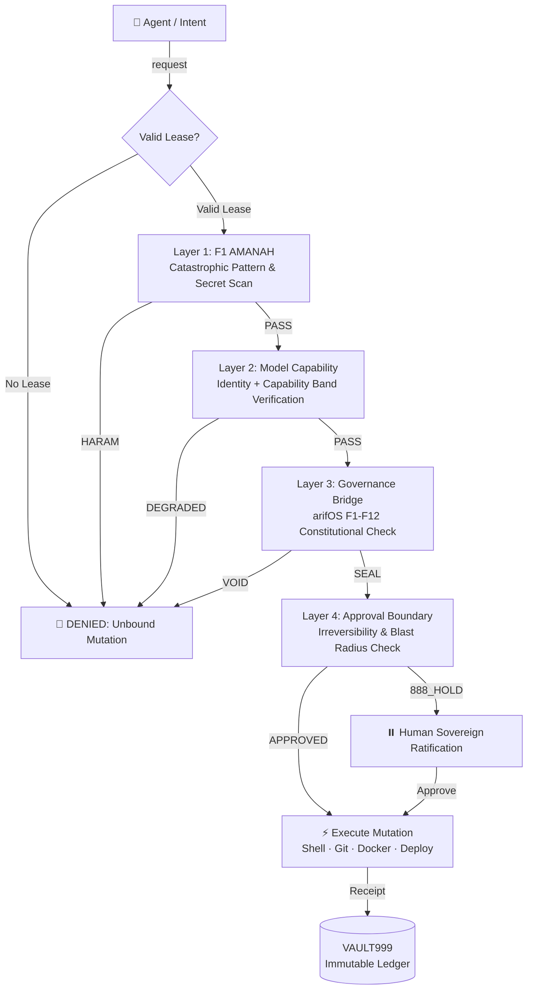

<!-- SOT-MANIFEST
federation_release: v2026.08.01
last_verified: 2026-08-01T00:45:00Z
live_commit: daccf54
qqq_version: v1.1.1 (10/10 tests passing, verdict round-trip closed)
seal_chain: append-only (chattr +a) + Merkle anchor every 100 receipts
sense_port: 7071 (healthy)
mcp_port: 7072 (healthy)
tools_exposed_via_mcp: 110 (live-witnessed 2026-08-01 via MCP tools/list on :7072)
authority_ceiling: 777_FORGE (execution only — never adjudicate)
owner_summary: GREEN (identity_present, service_healthy, deployment_drift: false)
truth_rule: MCP tools/list on :7072 beats any static count in prose
-->

# ⚒️ A-FORGE — Governed Execution Subprocessor & Systems Engineering Engine

[](https://github.com/ariffazil/A-FORGE/actions)
[](https://github.com/ariffazil/A-FORGE/actions)
[](https://github.com/ariffazil/A-FORGE/actions)
[](https://forge.arif-fazil.com/mcp)
[](https://arifos.arif-fazil.com)
[](./LICENSE)

**A-FORGE** is the governed execution subprocessor and systems engineering engine for the arifOS Federation. Operating on ports **7071** (Sense REST API) and **7072** (FastMCP Gateway), A-FORGE exposes **110 governed tools** providing safe, audited access to filesystem mutations, Git operations, Docker container fleets, and CI/CD pipelines.

> **The Separation Principle:**  
> *A-FORGE is the hands. arifOS is the brain. The hands execute. The brain judges. The hands never self-authorize.*

---

## 🔒 The 4-Layer Forge Gate & Gödel Lock

Every tool invocation or system mutation routed through A-FORGE must pass **4 sequential security gates**:



| Layer | Security Check | Execution Boundary |
|:---:|:---|:---|
| **Layer 1: F1 AMANAH** | Catastrophic pattern scan | Prevents dangerous system commands (`rm -rf /`, raw secret leaks) |
| **Layer 2: Model Capability** | Identity & capability band check | Enforces agent lease permissions & role-based access limits |
| **Layer 3: Governance Bridge** | arifOS F1–F12 floor evaluation | Blocks ungrounded or epistemically invalid mutations (`VOID`) |
| **Layer 4: Approval Boundary** | Irreversibility & blast radius check | Triggers `888_HOLD` for high-blast operations requiring sovereign veto |

### The Gödel Lock Invariant
A-FORGE **cannot seal its own execution outcomes**. The executor cannot certify its own work—every `forge_execute` receipt must be cryptographically witnessed and sealed by the **arifOS Kernel** or ratified by **Arif (F13 Sovereign)**.

---

## 🛠️ Core Capabilities (110 Live Tools)

A-FORGE hosts 110 governed tools across five primary operational domains:

- **Filesystem & Codebase Operations:** Safe file edits, structural refactoring, multi-replace operations, and workspace boundary checks.
- **Git & Repository Management:** Automated commits, branch isolation, PR governance checklist validation, and release attestation.
- **Infrastructure & Container Management:** Bare-metal systemd unit management, Docker Compose fleet management, port health probes, and Caddy reverse-proxy checks.
- **CI/CD & Deployment:** GitHub Actions diagnostic analysis, automated deployment sync (`rsync`), and build pipeline verification.
- **Session & Capability Tokens (SCT):** Session token minting, capability verification, and authentication binding.

---

## ⚡ Deployment & Operational Architecture

A-FORGE runs as dual bare-metal systemd daemons on the VPS infrastructure:

```
Sense API Endpoint:  http://127.0.0.1:7071
MCP Gateway:         http://127.0.0.1:7072
Public MCP Surface:  https://forge.arif-fazil.com/mcp
```

### Production Operations

```bash
# 1. Inspect A-FORGE Live Health & Tool Witness
curl -s http://127.0.0.1:7071/health | jq .

# 2. Rebuild & Deploy A-FORGE
cd /root/A-FORGE
npm run build
systemctl restart a-forge
systemctl restart a-forge-mcp

# 3. Execute Full Verification Suite
make test
```

---

## 🏛️ Federation Separation of Powers

| Layer | Organ / Actor | Authority & Capability | Must Never |
|:---|:---|:---|:---|
| **Sovereign** | **ARIF (F13)** | Absolute Veto, final decision, policy ratification | Be overridden by algorithms |
| **Institution** | **AAA (:3001)** | Agent registration, A2A task routing, Cockpit UI | Self-issue verdicts or execute code |
| **Kernel** | **arifOS (:8088)** | Constitutional adjudication (`SEAL`, `HOLD`, `VOID`) | Execute code mutations directly |
| **Executor** | **A-FORGE (:7071)**| Systems engineering, CI/CD, deployment execution | Self-authorize mutations without SEAL |
| **Witnesses** | **GEOX / WEALTH / WELL** | Earth, capital, & human evidence calculation | Make sovereign decisions |
| **Ledger** | **VAULT999** | Cryptographic append-only proof store | Edit or erase historical receipts |

---

## 🔗 Federation Architecture & Navigation

A-FORGE operates as the Governed Execution Engine for the **arifOS Federation**. Every organ maintains distinct boundaries and capabilities:

| Organ | Domain Role | Port | Repo | Live MCP | Health Witness | Machine Spec |
|:---|:---|:---:|:---|:---|:---|:---|
| **arifOS** | Constitutional Kernel & Judge | 8088 | [repo](https://github.com/ariffazil/arifos) | [mcp](https://mcp.arif-fazil.com/mcp) | [health](https://arifos.arif-fazil.com/health) | [llms.txt](https://arifos.arif-fazil.com/llms.txt) |
| **A-FORGE** | Governed Execution Engine | 7071 / 7072 | [repo](https://github.com/ariffazil/A-FORGE) | [mcp](https://forge.arif-fazil.com/mcp) | [health](https://forge.arif-fazil.com/health) | [llms.txt](https://forge.arif-fazil.com/llms.txt) |
| **AAA** | Institution, Control Plane & A2A | 3001 | [repo](https://github.com/ariffazil/AAA) | — | [health](https://aaa.arif-fazil.com/health) | [llms.txt](https://aaa.arif-fazil.com/llms.txt) |
| **GEOX** | Earth Intelligence (Subsurface) | 8081 | [repo](https://github.com/ariffazil/GEOX) | [mcp](https://geox.arif-fazil.com/mcp) | [health](https://geox.arif-fazil.com/health) | [llms.txt](https://geox.arif-fazil.com/llms.txt) |
| **WEALTH** | Capital Intelligence (Compute) | 18082 | [repo](https://github.com/ariffazil/WEALTH) | [mcp](https://wealth.arif-fazil.com/mcp) | [health](https://wealth.arif-fazil.com/health) | [llms.txt](https://wealth.arif-fazil.com/llms.txt) |
| **WELL** | Vitality & Readiness Guard | 18083 | [repo](https://github.com/ariffazil/WELL) | [mcp](https://well.arif-fazil.com/mcp) | [health](https://well.arif-fazil.com/health) | [llms.txt](https://well.arif-fazil.com/llms.txt) |
| **HERMES** | Multi-Modal Bridge & Telegram Relay | 8644 | [repo](https://github.com/ariffazil/HERMES) | — | — | — |

**Public Domain:** [arif-fazil.com](https://arif-fazil.com) · **Federation Root:** [arifos.arif-fazil.com](https://arifos.arif-fazil.com)

---

## 📜 Sovereignty & License

- **License:** GNU Affero General Public License v3.0 (**AGPL-3.0**).
- **Sovereign Authority:** **Muhammad Arif bin Fazil** (F13 SOVEREIGN).

---

*DITEMPA BUKAN DIBERI — Execution is forged, not given.*  
*The hands never judge. The forge never self-authorizes. 999 SEAL ALIVE.*
