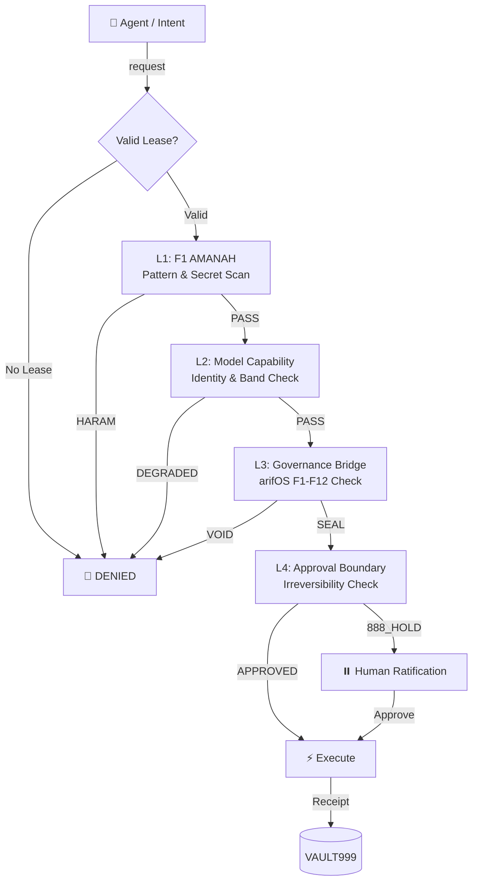
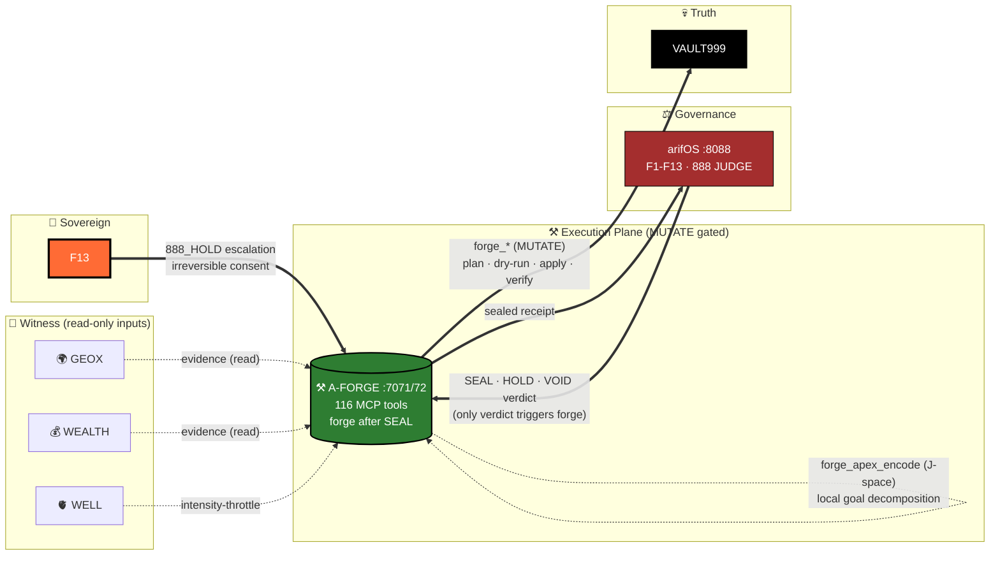

<!-- SOT-MANIFEST
federation_release: v2026.08.09
last_verified: 2026-08-11T05:58:51Z
live_commit: fbaffa76 (flame: wire Qwen config to free tier endpoint P1.5.2)
qqq_version: v1.1.1 (10/10 tests passing, verdict round-trip closed)
seal_chain: append-only (chattr +a) + Merkle anchor every 100 receipts
sense_port: 7071 (healthy)
mcp_port: 7072 (healthy — restored 2026-08-11 via a-forge-mcp.service systemd unit)
tools_exposed_via_mcp: 116 (live-witnessed via MCP tools/list on :7072)
authority_ceiling: 777_FORGE (execution only — never adjudicate)
owner_summary: GREEN (sense_api_healthy, mcp_gateway_healthy, deployment_drift: false)
truth_rule: MCP tools/list on :7072 beats any static count in prose
infra_organs: arifFlow:7073 METABOLISM, FED:7074 ADVISORY, FLAME:18901 ADVISORY, FRAME:frame-organ.service OBSERVE
audit_basis: 333-AGI Δ MIND session (2026-08-11)
-->

# ⚒️ A-FORGE — Governed Execution Shell

[](https://github.com/ariffazil/A-FORGE/actions)
[](https://github.com/ariffazil/A-FORGE/actions)
[](https://github.com/ariffazil/A-FORGE/actions)
[](https://forge.arif-fazil.com/mcp)
[](https://arifos.arif-fazil.com)
[](./LICENSE)

> **A-FORGE is the hands. It executes. It never self-authorizes.**
> **DITEMPA BUKAN DIBERI — Execution is forged, not given.**

**A-FORGE** is the governed execution subprocessor of the arifOS Federation. Operating on ports **7071** (Sense API) and **7072** (FastMCP Gateway), it exposes **110 governed tools** for filesystem mutations, Git operations, Docker container fleets, CI/CD pipelines, and VPS infrastructure — all gated behind the arifOS constitutional kernel.

---

## 🔒 The 4-Layer Forge Gate



### The Gödel Lock
A-FORGE **cannot seal its own execution outcomes**. Every `forge_execute` receipt must be cryptographically witnessed and sealed by the **arifOS Kernel** or ratified by **Arif (F13 Sovereign)**. The executor never certifies its own work.

---

## 🛠️ Core Capabilities (110 Live Tools)

| Domain | Tools | Examples |
|--------|-------|---------|
| **Filesystem** | 15+ | Safe file edits, structural refactoring, multi-replace |
| **Git & Repo** | 12+ | Automated commits, PR governance, release attestation |
| **Infrastructure** | 20+ | systemd management, Docker Compose, port probes, Caddy |
| **CI/CD** | 10+ | GitHub Actions diagnostics, rsync deploy, build verification |
| **Governance** | 25+ | Session tokens, leases, APEX evaluation, witness consensus |
| **Browser & Web** | 8+ | Browser automation, screenshots, visual QA |
| **Vault & Memory** | 10+ | VAULT999 receipts, scar database, memory recall |

---

## 🗺️ Where A-FORGE Sits in the Federation



**A-FORGE internal loop (the Forge):**

```
intake (SEAL verdict from arifOS)
        │
        ▼
forge_plan (dry-run · dry-run diff)
        │
        ▼
forge_apex_encode (J-space: goal → tasks → J=∂T/∂G)
        │
        ▼
forge_apex_emd (EMD validation: C_dark, scope creep)
        │
        ▼
forge_pipeline_run (mode=forge → forge_predict → forge_execute)
        │
        ▼
forge_evaluate (G = (A·P·E·X)^¼ ≥ 0.80)
        │
        ▼
forge_runtime_verify (source commit vs runtime — fail-closed on drift)
        │
        ▼
forge_vault999_seal → VAULT999 (append-only receipt)
        │
        ▼
forge_cool_drift (cooling receipt — converges/diverges)
        │
        ▼
back to ARIFOS for next verdict
```

**Hard rules (777_FORGE ceiling):**
- A-FORGE never adjudicates. It only executes after `arif_judge SEAL` verdict.
- A-FORGE never self-authorizes. Even with `forge_evaluate G ≥ 0.80`, mutation requires kernel verdict.
- A-FORGE never reads VAULT999 as authority. It only WRITES to VAULT999.

---

## 🏅 Federation Certification

[](https://forge.arif-fazil.com/health)
[](https://arif-fazil.com/999/verify)
[](https://github.com/ariffazil/arifos/blob/main/GENESIS/000_KERNEL_CANON.md)

[](https://modelcontextprotocol.io)
[](https://github.com/ariffazil/arifos/blob/main/FEDERATION_CONTRACT.md)
[](https://github.com/ariffazil/A-FORGE/blob/main/FEDERATION_CONTRACT.md)

[](https://github.com/ariffazil/A-FORGE)
[](https://github.com/ariffazil/A-FORGE)
[](https://github.com/modelcontextprotocol/typescript-sdk)
[](https://github.com/ariffazil/A-FORGE/blob/main/LICENSE)

[](https://github.com/ariffazil/A-FORGE/actions/workflows/agentic-ci.yml)
[](https://github.com/ariffazil/A-FORGE/actions/workflows/governance-gate.yml)
[](https://github.com/ariffazil/A-FORGE/actions/workflows/a-forge-boundary-guard.yml)

---

## ⚡ Production Operations

```bash
# Live Health
curl -s http://127.0.0.1:7071/health | jq .

# Rebuild & Deploy
cd /root/A-FORGE && npm run build
systemctl restart a-forge && systemctl restart a-forge-mcp

# Full Test Suite
make test
```

```
Sense API:     http://127.0.0.1:7071
MCP Gateway:   http://127.0.0.1:7072
Public MCP:    https://forge.arif-fazil.com/mcp
```

---

## 🏛️ Federation Navigation

| Organ | Role | Port | Repo | MCP | Health | LLMs |
|:---|:---|:---:|:---|:---|:---|:---|
| **⚖️ arifOS** | Constitutional Kernel — judges, seals | 8088 | [repo](https://github.com/ariffazil/arifos) | [mcp](https://mcp.arif-fazil.com/mcp) | [health](https://arifos.arif-fazil.com/health) | [llms.txt](https://arifos.arif-fazil.com/llms.txt) |
| **⚒️ A-FORGE** | Execution Engine — builds, deploys | 7071/72 | [repo](https://github.com/ariffazil/A-FORGE) | [mcp](https://forge.arif-fazil.com/mcp) | [health](https://forge.arif-fazil.com/health) | [llms.txt](https://forge.arif-fazil.com/llms.txt) |
| **🏛️ AAA** | Control Plane — A2A gateway, cockpit | 3001 | [repo](https://github.com/ariffazil/AAA) | — | [health](https://aaa.arif-fazil.com/health) | [llms.txt](https://aaa.arif-fazil.com/llms.txt) |
| **🌍 GEOX** | Earth Intelligence — seismic, wells | 8081 | [repo](https://github.com/ariffazil/GEOX) | [mcp](https://geox.arif-fazil.com/mcp) | [health](https://geox.arif-fazil.com/health) | [llms.txt](https://geox.arif-fazil.com/llms.txt) |
| **💰 WEALTH** | Capital Intelligence — NPV, risk | 18082 | [repo](https://github.com/ariffazil/WEALTH) | [mcp](https://wealth.arif-fazil.com/mcp) | [health](https://wealth.arif-fazil.com/health) | (llms.txt pending) |
| **🫀 WELL** | Vitality Guard — human readiness | 18083 | [repo](https://github.com/ariffazil/WELL) | [mcp](https://well.arif-fazil.com/mcp) | [health](https://well.arif-fazil.com/health) | [llms.txt](https://well.arif-fazil.com/llms.txt) |
| **🫀 arifFlow** | Metabolism — FQ pulse, receipts | 7073 | [repo](https://github.com/ariffazil/arifFlow) | — | [health](https://arifflow.arif-fazil.com/health) | — |
| **🧭 FED** | Route Advisor — model/provider ranking | 7074 | private (internal) | — | [health](https://fed.arif-fazil.com/health) | — |
| **🔥 FLAME** | RM0 Inference — free-loop model mesh | 18901 | private (internal) | — | [health](https://flame.arif-fazil.com/health) | — |
| **🧱 FRAME** | Substrate — federation scaffolding | frame-organ.service | private (internal) | — | — | — |
| **🔮 HERMES** | Multi-Modal Bridge — Telegram relay | 8644 | [repo](https://github.com/ariffazil/HERMES) | — | — | — |
| **🌐 arif-fazil.com** | Public Web Surface — one domain | 443 | [repo](https://github.com/ariffazil/arif-fazil.com) | — | [verify](https://arif-fazil.com/999/verify) | — |

---

## 📡 MCP Registries (live-validated 2026-08-11)

| Registry | Status | Notes |
|----------|--------|-------|
| **TurboMCP** (ex-mcp.run) | ❌ 404 (2026-08-11) | Federation entry was `turbomcp.ai/server/ariffazil/arifos` — now 404, removed |
| **Glama** | �️ 301 → [glama.ai/mcp/servers/ariffazil/arifos](https://glama.ai/mcp/servers/ariffazil/arifos) | A-FORGE is not listed separately — uses `ariffazil/arifos` umbrella |

**Removed dead URLs** (validated 404): `smithery.ai/server/a-forge`, `mcp.so/server/ariffazil/a-forge`, individual `glama.ai/mcp/servers/ariffazil/a-forge` (redirects to arifos).

Discovery endpoint: `GET https://arif-fazil.com/.well-known/mcp/server.json` (canonical, 37 KB)

---

---

## 🛡️ CI Governance (F13 verdict 2026-08-10)

This repo follows the federation's CI governance pattern (replicated from `ariffazil/arifOS` PR #683). The pattern ensures Dependabot PRs receive a real, reproducible unprivileged verdict — no more all-red check rolls from structurally-incompatible gates.

**Per-repo adapter** (see `.github/workflows/` for the actual files):

- `.github/dependabot.yml` — `uv` (Python) / `cargo` (Rust) / `npm` (TypeScript) ecosystem; cooldown 3d; open-PRs 5; constitutional packages un-grouped (no `ignore:` — visibility preserved)
- `.github/workflows/dependabot-ci.yml` — unprivileged gate; runs ONLY on Dependabot PRs; SHA-bound probes
- `.github/workflows/{ci-uv-lock-invariant|cargo-lock-invariant|npm-lock-invariant}.yml` — universal `{uv lock --check && uv sync --frozen | cargo check --locked && cargo build --locked | npm ci}` invariant on every PR + push to main
- `.github/workflows/auto-merge-dependabot.yml` — constitutional package denylist (per-language); F13 review the only merge path
- Privileged workflows gated with `if: github.actor != 'dependabot[bot]' && github.actor != 'app/dependabot'` — so they SKIP for Dependabot PRs where their inputs cannot be satisfied

**Constitutional packages** (denied auto-merge, require F13 review):

| Language | Denylist |
|---|---|
| Python | `protobuf`, `cryptography`, `fastmcp-slim`, `fastmcp`, `caio`, `sentence-transformers`, `pynacl`, `blake3` |
| Rust    | `serde`, `tokio`, `hyper`, `axum`, `reqwest`, `rustls`, `async-trait`, `clap`, `tracing` |
| TypeScript | `zod`, `@modelcontextprotocol/sdk`, `fastmcp`, `mcp-sdk`, `tsx`, `vitest`, `@types/node`, `typescript`, `ts-node` |
| Static site | `vite`, `react`, `react-dom`, `react-router`, `@tanstack/react-query`, `tailwindcss` |

**Reference:** [`/root/AGENTS.md`](/root/AGENTS.md) — canonical federation doctrine. `AAA/docs/ORGAN.md` — topology.

DITEMPA BUKAN DIBERI — governance is forged, not given.

## 📜 Sovereignty & License

- **License:** GNU Affero General Public License v3.0 (**AGPL-3.0**)
- **Sovereign:** **Muhammad Arif bin Fazil** (F13 SOVEREIGN)

> *DITEMPA BUKAN DIBERI — Forged, Not Given.*  
> *The hands never judge. The forge never self-authorizes. 999 SEAL ALIVE.*
