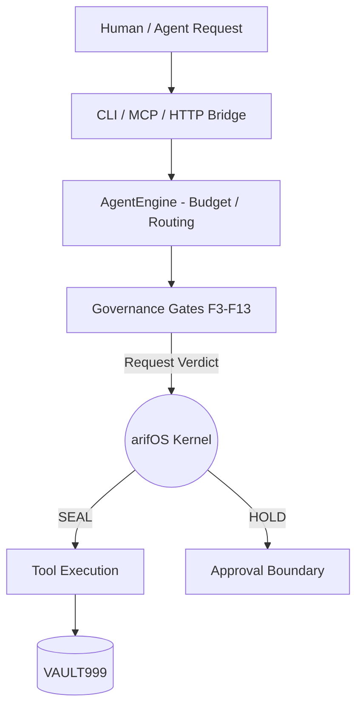

<!-- SOT-MANIFEST
owner: Arif
last_verified: 2026-05-23
valid_from: 2026-05-23
valid_until: 2026-06-23
confidence: high
scope: /root/A-FORGE
epistemic_status: CLAIM
-->

# A-FORGE — Governed Execution Runtime

> **In one sentence:** A-FORGE is the engine — when arifOS says "SEAL," A-FORGE is what actually runs the code, builds the artifact, or executes the task on the VPS.

**Status:** EXECUTION (Current L3 State) | **Organ:** FORGE (Ξ)
**Target State:** [AAA² Execution Substrate](../AAA/docs/architecture/AAA2_Kernel_UAA_PSP_v2026.05.md)

---

## 🏛️ What this repo IS
- The **Execution runtime** for governed agents.
- The **AgentEngine** that orchestrates tools, plans, and budget.
- The **Enforcement bridge** that physically gates execution based on arifOS verdicts.

## 🚫 What this repo is NOT
- **The Law:** A-FORGE executes under governance. It does not grant itself authority.
- **The Cockpit:** A-FORGE is headless. Interfaces live in [AAA](../AAA).

*Important:* We run the code upon SEAL. We do not claim judgment or law authority.

---

## 🔄 Execution Flow

---

## 🗺️ Canonical Repo Contents

- **`src/`**: The ONLY canonical TypeScript source. Contains `engine/`, `mcp/`, `governance/`, `tools/`.
- **`dist/`**: Compiled NodeNext ESM resolution builds. Never edit directly.
- **`test/`**: Node.js built-in `node:test` suite.

### 📌 The AAA² Target State
*In the AAA² roadmap, A-FORGE will evolve into the Execution Substrate (Ξ), abstracting Docker/Process/WASM environments to execute governed actions passed via the Portable State Protocol.*

---
*Last Verified: 2026-05-23 | 999 SEAL ALIVE*
