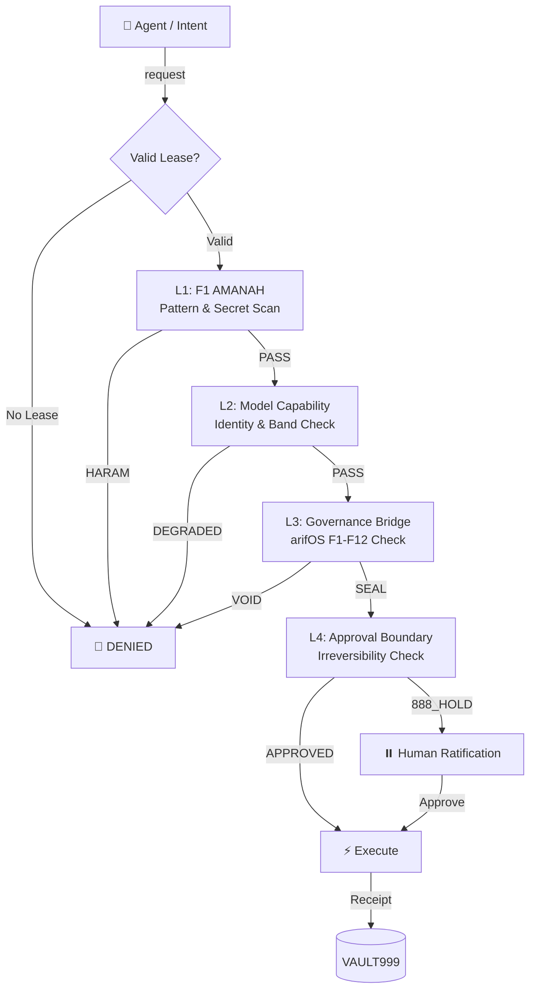

<!-- SOT-MANIFEST
federation_release: v2026.08.04
last_verified: 2026-08-04T20:23:33Z
live_commit: pending
qqq_version: v1.1.1 (10/10 tests passing, verdict round-trip closed)
seal_chain: append-only (chattr +a) + Merkle anchor every 100 receipts
sense_port: 7071 (healthy)
mcp_port: 7072 (healthy)
tools_exposed_via_mcp: 110 (live-witnessed via MCP tools/list on :7072)
authority_ceiling: 777_FORGE (execution only — never adjudicate)
owner_summary: GREEN (identity_present, service_healthy, deployment_drift: false)
truth_rule: MCP tools/list on :7072 beats any static count in prose
-->

# ⚒️ A-FORGE — Governed Execution Shell

[](https://github.com/ariffazil/A-FORGE/actions)
[](https://github.com/ariffazil/A-FORGE/actions)
[](https://github.com/ariffazil/A-FORGE/actions)
[](https://forge.arif-fazil.com/mcp)
[](https://arifos.arif-fazil.com)
[](./LICENSE)

> **A-FORGE is the hands. It executes. It never self-authorizes.**
> **DITEMPA BUKAN DIBERI — Execution is forged, not given.**

**A-FORGE** is the governed execution subprocessor of the arifOS Federation. Operating on ports **7071** (Sense API) and **7072** (FastMCP Gateway), it exposes **110 governed tools** for filesystem mutations, Git operations, Docker container fleets, CI/CD pipelines, and VPS infrastructure — all gated behind the arifOS constitutional kernel.

---

## 🔒 The 4-Layer Forge Gate



### The Gödel Lock
A-FORGE **cannot seal its own execution outcomes**. Every `forge_execute` receipt must be cryptographically witnessed and sealed by the **arifOS Kernel** or ratified by **Arif (F13 Sovereign)**. The executor never certifies its own work.

---

## 🛠️ Core Capabilities (110 Live Tools)

| Domain | Tools | Examples |
|--------|-------|---------|
| **Filesystem** | 15+ | Safe file edits, structural refactoring, multi-replace |
| **Git & Repo** | 12+ | Automated commits, PR governance, release attestation |
| **Infrastructure** | 20+ | systemd management, Docker Compose, port probes, Caddy |
| **CI/CD** | 10+ | GitHub Actions diagnostics, rsync deploy, build verification |
| **Governance** | 25+ | Session tokens, leases, APEX evaluation, witness consensus |
| **Browser & Web** | 8+ | Browser automation, screenshots, visual QA |
| **Vault & Memory** | 10+ | VAULT999 receipts, scar database, memory recall |

---

## ⚡ Production Operations

```bash
# Live Health
curl -s http://127.0.0.1:7071/health | jq .

# Rebuild & Deploy
cd /root/A-FORGE && npm run build
systemctl restart a-forge && systemctl restart a-forge-mcp

# Full Test Suite
make test
```

```
Sense API:     http://127.0.0.1:7071
MCP Gateway:   http://127.0.0.1:7072
Public MCP:    https://forge.arif-fazil.com/mcp
```

---

## 🏛️ Federation Navigation

| Organ | Role | Port | Repo | MCP | Health | LLMs |
|:---|:---|:---:|:---|:---|:---|:---|
| **⚖️ arifOS** | Constitutional Kernel — judges, seals | 8088 | [repo](https://github.com/ariffazil/arifos) | [mcp](https://mcp.arif-fazil.com/mcp) | [health](https://arifos.arif-fazil.com/health) | [llms.txt](https://arifos.arif-fazil.com/llms.txt) |
| **⚒️ A-FORGE** | Execution Engine — builds, deploys | 7071/72 | [repo](https://github.com/ariffazil/A-FORGE) | [mcp](https://forge.arif-fazil.com/mcp) | [health](https://forge.arif-fazil.com/health) | [llms.txt](https://forge.arif-fazil.com/llms.txt) |
| **🏛️ AAA** | Control Plane — A2A gateway, cockpit | 3001 | [repo](https://github.com/ariffazil/AAA) | — | [health](https://aaa.arif-fazil.com/health) | [llms.txt](https://aaa.arif-fazil.com/llms.txt) |
| **🌍 GEOX** | Earth Intelligence — seismic, wells | 8081 | [repo](https://github.com/ariffazil/GEOX) | [mcp](https://geox.arif-fazil.com/mcp) | [health](https://geox.arif-fazil.com/health) | [llms.txt](https://geox.arif-fazil.com/llms.txt) |
| **💰 WEALTH** | Capital Intelligence — NPV, risk | 18082 | [repo](https://github.com/ariffazil/WEALTH) | [mcp](https://wealth.arif-fazil.com/mcp) | [health](https://wealth.arif-fazil.com/health) | [llms.txt](https://wealth.arif-fazil.com/llms.txt) |
| **🫀 WELL** | Vitality Guard — human readiness | 18083 | [repo](https://github.com/ariffazil/WELL) | [mcp](https://well.arif-fazil.com/mcp) | [health](https://well.arif-fazil.com/health) | [llms.txt](https://well.arif-fazil.com/llms.txt) |
| **🔮 HERMES** | Multi-Modal Bridge — Telegram relay | 8644 | [repo](https://github.com/ariffazil/HERMES) | — | — | — |
| **🌐 arif-fazil.com** | Public Web Surface — one domain | 443 | [repo](https://github.com/ariffazil/arif-fazil.com) | — | [verify](https://arif-fazil.com/999/verify) | — |

---

## 📜 Sovereignty & License

- **License:** GNU Affero General Public License v3.0 (**AGPL-3.0**)
- **Sovereign:** **Muhammad Arif bin Fazil** (F13 SOVEREIGN)

> *DITEMPA BUKAN DIBERI — Forged, Not Given.*  
> *The hands never judge. The forge never self-authorizes. 999 SEAL ALIVE.*
