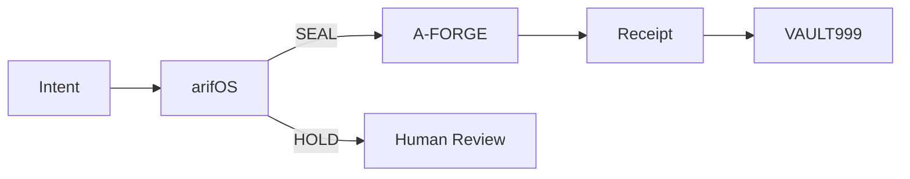

# A-FORGE

## Execute only what has been authorized.

The governed execution shell of the arifOS Federation.

A-FORGE is the hands.

It executes.
It never judges.
It never self-authorizes.

DITEMPA BUKAN DIBERI.

---

## Why A-FORGE exists

Three questions govern every action:

1. Who **performs** the action?
2. Who **approved** the action?
3. Who **witnessed** the action?

A-FORGE answers only the first.

Approval belongs to arifOS.
Authority belongs to the sovereign.
Receipts belong to VAULT999.

## What you get

```text
Input:
SEAL + lease + session

Output:
Execution + receipt
```

## What A-FORGE does NOT do

> **A-FORGE is not a judge.**
> **A-FORGE is not a policy engine.**
> **A-FORGE does not emit SEAL.**
> **A-FORGE does not emit HOLD.**
> **A-FORGE never certifies its own execution.**

## 30-second proof

```text
Request: "delete production database"
  Without SEAL        → HOLD

Request: "deploy approved release"
  With SEAL + lease   → Execute
                     → Receipt
                     → VAULT999
```

Witnessed example (live, 2026-08-25 11:45 MYT):

```json
{
  "schema": "arif-sites.deploy-receipt.v1",
  "site": "arif-fazil.com",
  "deploy_tag": "20260825T034508317886476Z",
  "status": "live",
  "source_commit": "9090ff5",
  "backup_path": "/root/forge_work/deployments/arif-fazil.com/20260825T034508317886476Z/previous",
  "probe": { "url": "https://arif-fazil.com/", "code": "200", "ok": true }
}
```

## Architecture in one sentence

**The executor never certifies its own work.**



## Federation card

ARIF = Sovereign · arifOS = Law · AAA = Institution · A-FORGE = Hands

ARIF vetoes. arifOS judges. AAA routes. A-FORGE executes.

See: `arifOS/docs/FEDERATION_CARD.md`

---

<!--
SKELETON — DRAFT, NOT LIVE. Working-tree only. Untracked. Awaiting F13 review.
Promotion notes (audit 2026-08-25):
1. Tool count badge in current README says 116 (stamped 2026-08-14). Live tools/list TODAY = 114 (113 forge_* + 1 session helper), session held via forge.arif-fazil.com/mcp. Re-stamp on promotion; never carry the stale number.
2. Move OUT of first-contact README into existing docs/ + governance/ (architecture/ does not exist yet — create or fold into docs/):
   - 13 Eureka principles
   - CI governance details (badge row stays, doctrine moves)
   - package denylists
   - tool category inventories
   - federation navigation tables (ladder 000-999 detail)
   - certification matrices
3. SOT-MANIFEST comment block at top of current README: keep (it is machine-read), but verify every claim inside it on promotion.
4. Single Mermaid only. This one. Delete the ladder diagram from the fold; ladder belongs in docs/.
-->
