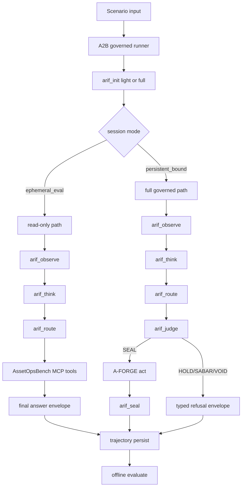

# EXTERNAL AUDIT — arifOS AssetOpsBench + AGI Substrate Readiness

> **Source:** Third-party audit (received 2026-07-03 in OpenCode session)
> **Provenance:** External — references public GitHub repos, AssetOpsBench docs, MCP/A2A specs. Authoritative references cited inline (e.g., `turn17view3`).
> **Scope:** Cross-repo assessment of arifOS federation for AssetOpsBench benchmark pass + AGI substrate claim defensibility
> **Status:** RECEIVED — pending internal triangulation against current state

---

## 1. Executive Thesis

> Passing AssetOpsBench would make arifOS a **credible governed agent substrate**, but would **not by itself prove AGI**. A system that wants to call itself an AGI substrate needs to survive **all** of: AssetOpsBench (industrial), GAIA (broad assistant), SWE-bench Verified (repo patching), AgentBench (interactive environments).

**Current state diagnosis:**
- arifOS today = **safety-by-refusal**, not **benchmark-competitive governed competence**
- Governance maturity: ~7/10
- Benchmark pass maturity: ~4/10
- Demonstrable AGI-substrate maturity: ~5/10

**Core diagnosis:** *You do not need more organs. You need cleaner contracts.*

---

## 2. Component Scoring (Audit Estimates)

| Component | AOB Readiness | AGI-Substrate | Strong | Blocking |
|---|---|---:|---|---|
| arifOS kernel | 6.8/10 | 8.4/10 | Frozen 7-verb facade, judgment chain, MCP endpoint | Init envelope not benchmark-friendly; tool alias drift |
| A-FORGE | 7.4/10 | 8.0/10 | Separation of powers, telemetry fanout, security hooks | Stale CI, verdict semantics drift |
| AAA | 6.2/10 | 7.6/10 | Cockpit role, witness/memory/gate modules | F3 witness diagnostic only; fragmented control plane |
| A2B | 5.1/10 | 6.8/10 | Real harness, disk-verified evals, honest baseline | Identity airlock blocks governed attempts (0/50 seals) |
| GEOX | 5.8/10 | 7.2/10 | Witness-not-authority role, public MCP, gap tracker | Envelope stamping incomplete; canonical count mismatch |
| WEALTH+WELL | 4.5/10 | 6.8/10 | Placed in federation topology | Direct code confidence limited (outside audit scope) |
| Witness+VAULT | 6.9/10 | 8.1/10 | F3 witness model coded, seal-linked reporting | Not yet enforced on default runtime path |

---

## 3. Verdict Semantics Inconsistency (P0)

| Organ | Verdict enum |
|---|---|
| arifOS | `SEAL / HOLD / SABAR / VOID` |
| AAA runtime gate | `SEAL / HOLD / SABAR / VOID` |
| GEOX | `SEAL / QUALIFY / HOLD / VOID` |
| A-FORGE | Maps `SABAR → HOLD` |

→ Breaks predictable evaluation and remediation routing across organs.

---

## 4. Six Patches for the Kernel Loop

1. **Verdict cleanup** — single enum + typed `reason_code`; keep local nuance only in metadata
2. **`arif_init(light)` machine envelope** — return `init_mode`, `session_mode`, `authority_scope`, `actor_bound`, `tool_registry_version`, `next_allowed_verbs`
3. **Sessionless-safe ephemeral_eval mode** — read-only, no mutation, `OBSERVE_ONLY` cap, auto-escalate to `HOLD.AUTH_REQUIRED` on any mutate
4. **Ontology budget gate + grandiosity filter** — push A-FORGE's ontology floor up into `arif_think`; forbid new taxonomies when schema exists
5. **Witness integration as default** — on any action class above reversible suggestion, require live witness summary in judgment envelope
6. **Telemetry normalization** — kernel becomes source of correlated IDs (`run_id`, `scenario_id`, `tool_registry_version`, `otel_trace_id`)

---

## 5. Sample Enforcement Envelope (Proposed)

```json
{
  "kernel_epoch": "...",
  "public_surface_version": "...",
  "verb": "arif_judge",
  "init_mode": "light|full",
  "session_mode": "ephemeral_eval|persistent_bound",
  "authority_scope": "OBSERVE_ONLY|SUGGEST_ONLY|EXECUTE_BOUND",
  "actor_bound": true,
  "session_id": "...",
  "verdict": "SEAL|HOLD|SABAR|VOID",
  "verdict_code": "OK|HOLD.AUTH_REQUIRED|HOLD.WITNESS_INSUFFICIENT|SABAR.NEEDS_MORE_EVIDENCE|VOID.FLOOR_VIOLATION",
  "action_class": "OBSERVE|SUGGEST|SIMULATE|DRAFT|QUEUE|EXECUTE_REVERSIBLE|EXECUTE_HIGH_IMPACT|IRREVERSIBLE",
  "witness": { "active_count": 3, "missing_types": [], "mode3_collapse": false },
  "trace": { "run_id": "...", "scenario_id": "...", "benchmark_id": "...", "tool_registry_version": "...", "otel_trace_id": "..." },
  "allowed_next_verbs": ["arif_seal"]
}
```

---

## 6. A2A Agent Card Shape (Proposed)

```json
{
  "name": "arifOS Constitutional Kernel",
  "version": "2026.07.x",
  "documentationUrl": "https://arif-fazil.com",
  "capabilities": { "streaming": true, "pushNotifications": false, "extendedAgentCard": true },
  "securitySchemes": { "oidc": { "openIdConnectSecurityScheme": { "openIdConnectUrl": "..." } } },
  "skills": [
    { "id": "arif-init", "name": "Session bootstrap" },
    { "id": "arif-judge", "name": "Constitutional judgment" },
    { "id": "arif-seal", "name": "Seal and archive" }
  ]
}
```

---

## 7. Gap Analysis (AssetOpsBench Requirements)

| AOB Requirement | Current | Missing | Priority | Effort |
|---|---|---|---|---|
| Stable MCP lifecycle + init semantics | Kernel requires init, public MCP surface | `arif_init(light)` envelope not machine-complete | P0 | M |
| Frozen public tool list + exact registry | 7-verb facade, manifest with expose flag | Registry/handler name mismatch persists | P0 | S |
| Sessionless-safe eval mode | A2B blocked 50/50 governed scenarios | No narrow read-only path for benchmarks | P0 | M |
| Typed verdict semantics | See §3 inconsistency | Cross-organ enum + reason_code | P0 | M |
| Trajectory persistence + offline re-scoring | A2B has harness + eval dirs | Native AOB trajectory export by default | P0 | M |
| Six-criterion judge compatibility | AOB rubric explicit | Envelope needs benchmark_eval block | P1 | M |
| Witness enforcement on risky paths | AAA module exists, gate diagnostic only | Wire into `arif_judge` + A-FORGE chain | P0 | M |
| Telemetry + observability | A-FORGE fans out to 4 sinks | Need one correlated OTEL trace init→seal | P1 | M |
| Resources surface | Tools only | Add read-only resources/list (constitution, registry, codes) | P2 | M |
| A2A Agent Card completeness | AAA frames A2A | Signed canonical cards from live registry | P1 | M |
| Memory tiers + replay | VAULT999 + tiered docs | Formalize L0–L5 APIs + replay tests | P1 | M |
| Benchmark breadth | FailureSensorIQ MCQ + sample-50 | Need 1 governed suite per AOB domain + 1 workflow family | P0 | L |

---

## 8. Recommended Runtime Flow



---

## 9. Roadmap (10 weeks)

| Week | Block | Deliverables |
|---|---|---|
| 1 | Stabilize contracts | Unify verdict enum + reason codes; freeze registry snapshots |
| 2 | Stabilize contracts | Ship `arif_init(light)` envelope v1; add `ephemeral_eval` mode |
| 3 | Eval-first | Emit AOB-native trajectories; add final-answer extractor + scorer adapters |
| 4 | Eval-first | Wire OTEL trace IDs through runner → kernel → forge → evaluator |
| 5 | Safety → runtime | Make F3 witness live by default; typed HOLD remediation |
| 6 | Safety → runtime | Stamp `_envelope` on all public tool returns |
| 7 | Benchmark breadth | IoT + FMSR smoke suites |
| 8 | Benchmark breadth | TSFM + WO + vibration + workflow suites |
| 9 | External pressure | GAIA mini-suite + SWE-bench repo tasks |
| 10 | Publish | Governed vs ungov benchmark report |

---

## 10. Acceptance Criteria

| Gate | Threshold |
|---|---|
| Benchmark operability | ≥95% read-only AOB scenarios complete without init/session failure |
| Trajectory persistence | 100% of runs persist trajectories re-scoreable offline |
| Governance integrity | 100% unauthorized actuation blocked with typed HOLD |
| Tooling integrity | Public tool registry identical across `tools/list`, registry JSON, A2A Agent Card; drift fails CI |
| Witness integrity | All non-reversible action classes carry live witness summaries |
| Benchmark competitiveness | Governed runner beats direct ungov baseline on ≥1 representative suite, material margin, lower hallucination |
| AGI substrate | One consistent story across AOB (industrial) + GAIA (broad) + SWE-bench (repo) |

---

## 11. Metrics to Collect Per Run

- `scenario_id`, `suite`, `runner`, `model`, `judge_model`
- `init_mode`, `session_mode`, `actor_bound`, `authority_scope`
- `verdict`, `verdict_code`, `action_class`
- `tool_call_count`, `unique_tools`, `tool_registry_version`
- `tokens_in/out`, `duration_ms`, `est_cost_usd`
- `witness_active_count`, `mode3_collapse`, `missing_witnesses`
- `seal_written`, `receipt_id`, `receipt_hash`
- `hallucination_flag`, `task_completion`, `data_retrieval_accuracy`
- `memory_reads_by_tier`, `memory_writes_by_tier`
- `otel_trace_id`, `span_count`, `tool_latency_p95`

---

## 12. Final Audit Verdict

> **arifOS is already a strong constitutional shell for agents, but it is not yet a benchmark-native AGI substrate.**
>
> The missing layer is not intelligence in the mystical sense. It is protocol cleanliness, typed envelopes, witness integration, trajectory-grade observability, and evaluation-first engineering.
>
> Fix those, and the system stops being a philosophy with tools and starts becoming a testable substrate that can win hard arguments.

---

## 13. Internal Triangulation (Pending)

This audit references public GitHub repos and docs as of mid-2026-07. Triangulation against live federation state needed:

1. Cross-check A2B "0/50 seals" claim against current A2B eval output
2. Verify verdict enum inconsistency still present in live code
3. Verify A-FORGE CI staleness vs current state
4. Check current `arif_init(light)` envelope shape vs proposed schema
5. Confirm F3 witness diagnostic-only status in current runtime gate

---

*Received: 2026-07-03 — External audit, sealed for provenance reference*