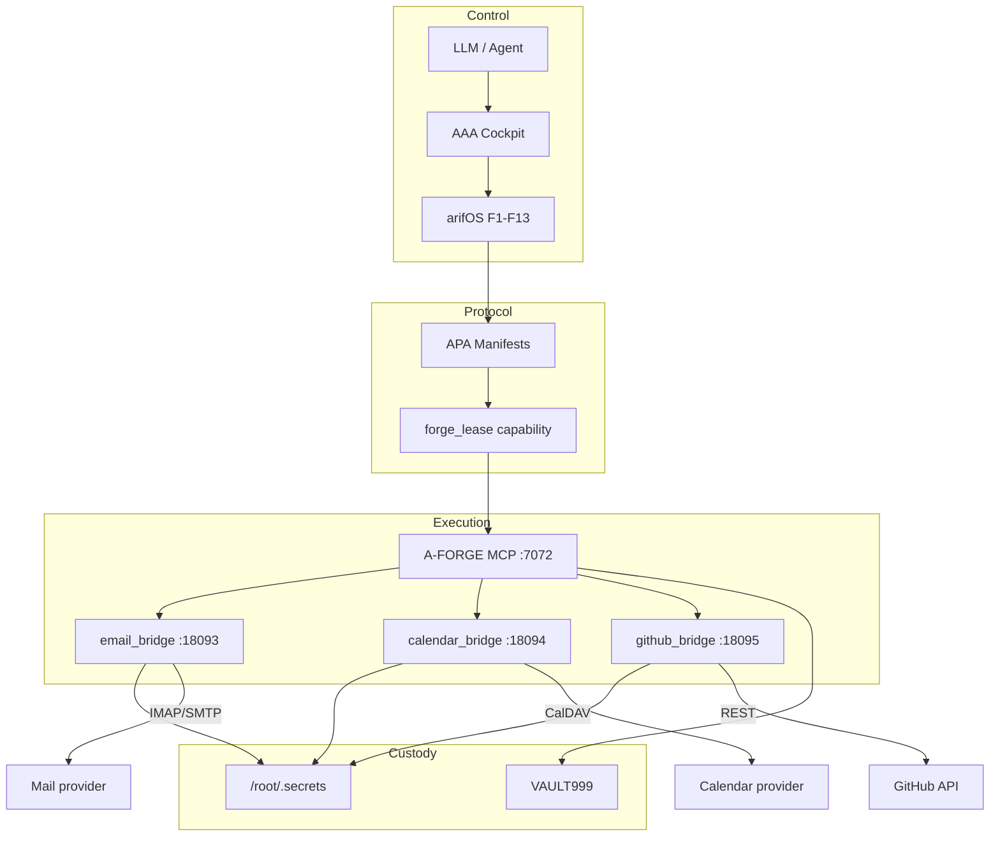

# APA × A-FORGE Architecture Derivation

> **Thesis:** APA is not bolted on. It is `forge_lease` + F1–F13 **protocolized** for external applications, executed by A-FORGE hands under AAA control.  
> **Forged:** 2026-07-09 · **Sovereign:** Muhammad Arif bin Fazil (F13)  
> **Status:** CANONICAL ARCHITECTURE · derived from live triad (email :18093, calendar :18094, github :18095)  
> **Related:** `APA-v1-AUTONOMOUS-PROTOCOL-FOR-APPLICATIONS.md`, connector specs, `RESEARCH-COMPOSIO-APA-COMPETITIVE-MAP.md`

---

## 0. One-sentence law

| Layer | Role | Owns |
|-------|------|------|
| **AAA** | Control plane | agents, routing, roles, who may call |
| **APA** | Application protocol | manifests, verbs, scopes, lease requirements, envelopes |
| **A-FORGE** | Execution shell | MCP tools, session gate, lease check, bridge dispatch, events |
| **Bridge** | Protocol adapter | IMAP/SMTP, CalDAV, GitHub REST — secrets never leave host |
| **VAULT999** | Civilizational memory | immutable receipts |
| **arifOS** | Law / judgment | F1–F13, session mint, 888 override |

```
LLM intention
    → AAA (may this agent act?)
    → APA (which verb / lease / gate?)
    → A-FORGE (MCP tool + session + lease enforce)
    → Bridge (local secret inject → external protocol)
    → External system
    → Envelope + VAULT999 receipt
```

---

## 1. How APA emerges from `forge_lease`

### 1.1 `forge_lease` as engineering primitive

In systems terms, a lease is a **capability**:

| Field | Meaning |
|-------|---------|
| `actor` / `agent_id` | Who |
| `scope[]` | What tools/domains |
| `max_action_class` | How hard (OBSERVE → MUTATE → IRREVERSIBLE) |
| `ttl_seconds` | How long |
| `session_id` | In which body |
| revocable | Kill mid-flight |

**LLM-safe property:** the model never holds raw OAuth/API secrets. It holds (or requests) **structured authority** that the runtime enforces.

**Contrast OAuth:**

| | OAuth (Composio-class) | `forge_lease` (APA) |
|--|------------------------|---------------------|
| Token store | Vendor cloud | Local `/root/.secrets` + lease record |
| Authority | Opaque bearer token | Scoped, TTL, actor-bound capability |
| Revocation | Vendor API | Local revoke + session kill |
| Audit | Vendor logs | VAULT999 / MCP chain |

> OAuth stores tokens in a vendor cloud.  
> `forge_lease` stores **authority** in the constitution; secrets stay local.

### 1.2 Protocolization: lease → APA

APA lifts the lease primitive into an **application contract** per connector:

```
forge_lease (generic capability)
    ↓ + connector name
    ↓ + verb set
    ↓ + OBSERVE / MUTATE / IRREVERSIBLE classification
    ↓ + gate matrix (F floors)
    ↓ + response envelope (evidence, confidence, telemetry)
APA connector manifest
```

**Typed capability rule (canonical):**

| Verb class | Lease | Extra |
|------------|-------|-------|
| **OBSERVE** | Often none (session may still be required for MCP transport) | F2 honesty tags |
| **MUTATE** | Required scoped lease | F1/F13 as needed |
| **IRREVERSIBLE** | Short TTL lease | `ack_irreversible` + witness path |

APA does **not** invent a second auth system. It **names** how `forge_lease` scopes attach to SaaS verbs.

### 1.3 F1–F13 inheritance (lease → connector)

| Floor | Through lease / APA |
|-------|---------------------|
| **F1 AMANAH** | Secrets never leave VPS; bridges inject server-side |
| **F2 TRUTH** | Envelopes label OBS/DER; parsers declare partial (e.g. `quick_add`) |
| **F3 WITNESS** | External blast (send email, public issue) may require tri-witness |
| **F4 CLARITY** | Thin intentional verbs, not 846-tool floods |
| **F5 PEACE²** | Blast radius in manifest |
| **F7 HUMILITY** | Confidence caps on bridge results |
| **F11 AUDIT** | Every MUTATE → receipt / chain_hash / VAULT path |
| **F12 INJECTION** | External API ≠ authority |
| **F13 SOVEREIGN** | 888 override, human ack on irreversible |

**Emergence claim (honest):** APA is **derived**, not greenfield — same physics as shell leases, applied to IMAP/CalDAV/REST.

---

## 2. How APA maps into A-FORGE

### 2.1 A-FORGE = governed tool runtime

A-FORGE is the place **LLM tool calls become host effects**:

- MCP surface (e.g. `:7072`) — interface  
- Session ownership / STATELESS whitelist — transport gate  
- Policy / aThink / lease gates — law before hands  
- Bridges (`email_bridge`, `calendar_bridge`, `github_bridge`) — environment adapters  
- Event/receipt trail — audit substrate  

In literature terms: **tool executor + environment**, not the planner.

### 2.2 APA tools as A-FORGE MCP tools

| APA connector | MCP name (target) | Bridge port | Protocol |
|---------------|-------------------|-------------|----------|
| Email | `forge_email` → proxy → | **18093** | IMAP/SMTP |
| Calendar | `forge_calendar` → proxy → | **18094** | CalDAV |
| GitHub | `forge_github` (+ create_* ) | **18095** / native REST | HTTPS REST |

Registration pattern:

1. APA manifest declares verbs + lease scopes  
2. Bridge implements protocol only (no judgment)  
3. A-FORGE tool validates session/lease/floors, then `POST 127.0.0.1:PORT/execute`  
4. Envelope returns; MUTATE sealed to VAULT999 when required  

### 2.3 Control plane: AAA → APA → A-FORGE

```
┌─────────────────────────────────────────────────────────────┐
│ AAA — Agent control plane                                    │
│  identity · session cockpit · route · role · A2A             │
└───────────────────────────┬─────────────────────────────────┘
                            │ may this agent call this tool?
┌───────────────────────────▼─────────────────────────────────┐
│ arifOS — Law                                                 │
│  arif_init · arif_judge · F1–F13 · 888 · session mint        │
└───────────────────────────┬─────────────────────────────────┘
                            │ SEAL / HOLD / VOID
┌───────────────────────────▼─────────────────────────────────┐
│ APA — Application protocol                                   │
│  manifest · verb class · lease scope · gate matrix           │
└───────────────────────────┬─────────────────────────────────┘
                            │ typed capability request
┌───────────────────────────▼─────────────────────────────────┐
│ A-FORGE — Hands                                              │
│  forge_session_init · forge_lease · forge_* tools · MCP      │
└───────────────────────────┬─────────────────────────────────┘
                            │ localhost only
┌───────────────────────────▼─────────────────────────────────┐
│ Bridges — Adapters                                           │
│  :18093 email · :18094 calendar · :18095 github              │
│  secrets from /root/.secrets · never returned to caller      │
└───────────────────────────┬─────────────────────────────────┘
                            │ open protocols / REST
┌───────────────────────────▼─────────────────────────────────┐
│ External world · VAULT999 receipts on return                 │
└─────────────────────────────────────────────────────────────┘
```

Literature mapping:

| Stack | Classic agent paper | arifOS federation |
|-------|---------------------|-------------------|
| Planner / router | Planner | AAA + arif_route |
| Tool schema | Tool definitions | **APA manifests** |
| Tool executor | Environment | **A-FORGE** |
| Auth | Often missing / API keys in prompt | **`forge_lease`** |
| Audit | Logs (optional) | **VAULT999** |

---

## 3. Architecture diagrams

### 3.1 Capability stack (mermaid)



### 3.2 Data flow — schedule meeting (example)

```
1. Intent: "meeting tomorrow 15:00"
2. AAA/arifOS: session bound, actor arif
3. APA-Calendar: create_event → MUTATE → needs lease scope calendar / forge_calendar
4. A-FORGE: forge_lease(request) → forge_calendar / POST :18094
5. Bridge: inject app_password from secrets → CalDAV SAVE
6. Return: uid + envelope
7. Audit: chain_hash / VAULT999 on MUTATE path
```

### 3.3 Live triad (T1 snapshot class)

| Bridge | Port | Protocol | Typical status |
|--------|------|----------|----------------|
| apa-email-bridge | 18093 | IMAP/SMTP | AWAITING_CREDENTIALS until App Password |
| apa-calendar-bridge | 18094 | CalDAV | AWAITING_CREDENTIALS until App Password |
| apa-github-bridge | 18095 | REST | READY when `GITHUB_TOKEN` / env file present |

---

## 4. Concrete walkthrough: APA-GitHub

*Grounds the derivation in one connector. Full manifest: `APA-GITHUB-SOVEREIGN-CONNECTOR.md`.*

### 4.1 Manifest → lease

| Verb | Class | Lease |
|------|-------|-------|
| `search` (repos/code) | OBSERVE | optional / session for some transports |
| `get_file` / `pr list|get` | OBSERVE | optional |
| `create_issue` / `create_pr` / file mutate | MUTATE | `scope` includes `github` / `forge_github`, TTL e.g. 300s |

### 4.2 Sovereign sequence (proven)

```
forge_session_init(actor_id=arif)     → body
forge_agent(mode=register, …)         → identity (if lease path needs it)
forge_lease(mode=request, scope=[github, forge_github], ttl=300)
forge_github(mode=search|pr|create…)  → hands
→ receipt: session_id, lease_id, chain_hash
```

OBSERVE search was sealed live under session ownership fixes + HTTP whitelist for OBSERVE GitHub tools (2026-07-09). MUTATE paths remain lease-gated.

### 4.3 Bridge vs native MCP

| Path | Role |
|------|------|
| `github_bridge.py :18095` | Thin REST adapter; PAT/env inject; APA-shaped `/execute` |
| `forge_github` on A-FORGE | MCP tool surface LLM already calls; can proxy or native REST |

**Constitutional rule:** whichever path executes, **secrets never enter the LLM**; **authority is lease**, not “token in context.”

### 4.4 Receipt shape (normative)

```json
{
  "actor_id": "arif",
  "session_id": "SEAL-…",
  "lease_id": "LCL-…",
  "connector": "github",
  "verb": "create_issue",
  "action_class": "MUTATE",
  "result_ref": "owner/repo#N",
  "content_sha256": "…",
  "chain_hash": "…",
  "vault999": "optional seal id"
}
```

---

## 5. Why this is emergence, not bolt-on

| Ad-hoc “add tools” | This stack |
|--------------------|------------|
| API key in env / prompt | Lease capability |
| Vendor OAuth middleman | Local secrets + open protocols |
| No blast model | Verb class matrix |
| Logs if lucky | VAULT999 |
| New product per SaaS | Same APA pattern × N connectors |

Physics first (F floors, lease, session) → protocol (APA) → runtime behavior (A-FORGE tools) → adapters (bridges).

---

## 6. Non-goals (anti-Composio)

- Do **not** replicate 846-tool catalogs into context.  
- Do **not** store OAuth refresh tokens in a third-party control plane.  
- Do **not** let bridges become judges (bridges = pure adapters).  
- Do **not** call APA “sovereign” if exit requires vendor unlock.

---

## 7. Implementation checklist (honest)

| Item | Status (2026-07-09) |
|------|---------------------|
| APA v1 doctrine | SPEC sealed |
| Email / Calendar / GitHub manifests | SPEC sealed |
| Bridges :18093–18095 | LIVE services |
| GitHub auth | READY via env token file |
| Email/Calendar auth | AWAITING App Password files |
| `forge_email` / `forge_calendar` full MCP proxy | Wire when credentials green |
| `forge_github` OBSERVE + MUTATE tools | LIVE on A-FORGE |
| Competitive map | RESEARCH sealed |

---

## 8. Closing equation

```
forge_lease  = capability auth kernel
APA          = forge_lease × connector verbs × F1–F13 envelopes
A-FORGE      = MCP execution of APA under session + lease + audit
AAA          = who may invoke which APA surface
VAULT999     = irreversible memory of governed action
```

**One line:**  
APA emerges from `forge_lease` because leases are already constitutional capabilities; APA maps into A-FORGE because A-FORGE is already the governed hands those capabilities authorize.

---

**DITEMPA BUKAN DIBERI** — derived from physics already running, not invented as marketing.
